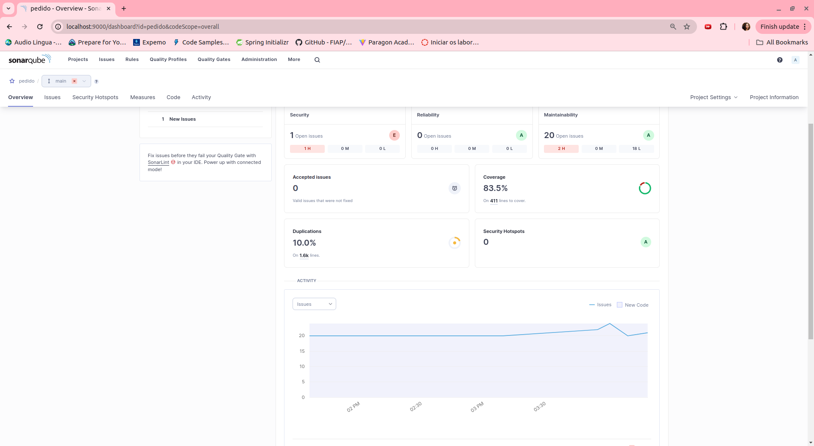

# Documentação da aplicação

Esta aplicação é referente a parte de pedido do Sistema da lanchonete.

Aqui ficam os cadastros dos pedidos e produtos.

## Como subir a aplicação

Para rodar a aplicação localmente, rode o comando './roda_spring_normal.sh' na raíz do projeto.

Caso queira rodar na nuvem usando kubernetes, rode terraform apply no repositório terraform-app para criar as instâncias EKS, 
e rode os arquivos yaml do kubernetes presentes neste projeto dentro da instância.

## Verificando cobertura de testes

Os testes de cobertura desta aplicação podem ser verificados rodando o seguinte comando no terminal (dentro da pasta raíz do projeto):
mvn clean verify sonar:sonar -Dsonar.projectKey=producao -Dsonar.host.url=http://localhost:9000 -Dsonar.login=<login_sonar> -Dsonar.password=<senha_sonar>

Na imagem abaixo é possível ver o relatório de cobertura do teste pelo sonar.

